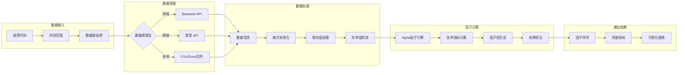
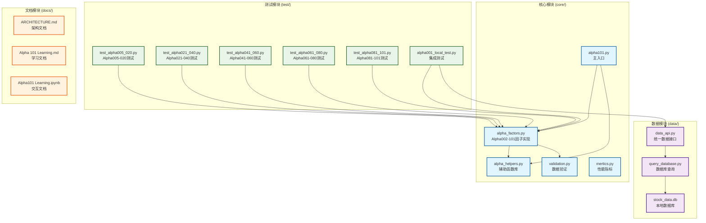
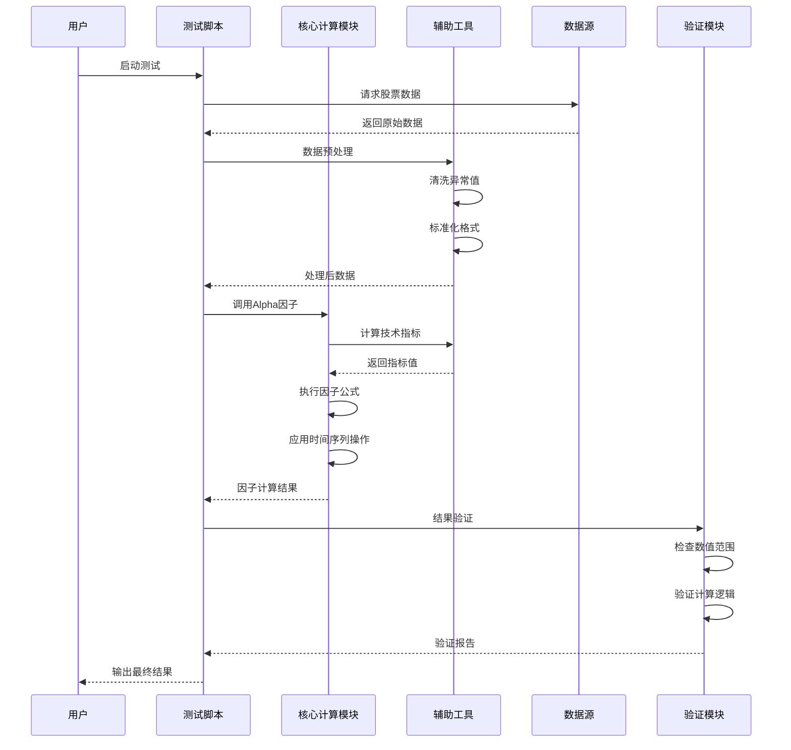
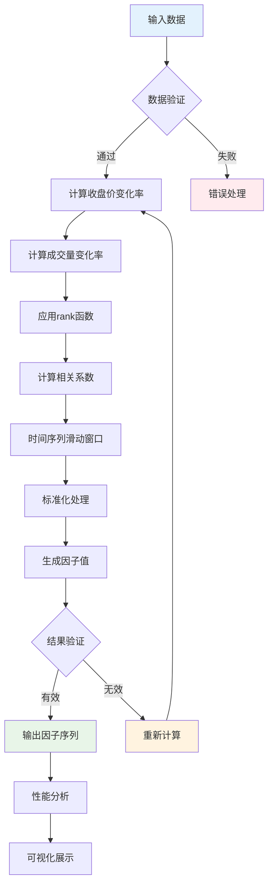
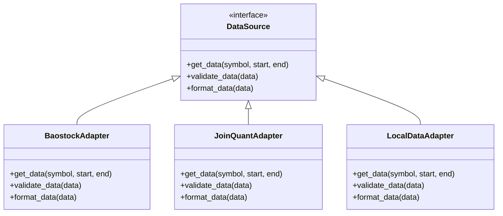

# Alpha101 量化因子系统

## 项目简介

Alpha101 是一个完整的量化因子计算系统，实现了《101 Formulaic Alphas》论文中的全部101个Alpha因子。系统专注于高效、准确的因子计算，为量化投资研究提供强大的特征工程工具。

## 版本信息

- **当前版本**: v1.0.1 (三层架构 - 已实现)
- **规划版本**: v1.0.2 (五层架构 - 包含信号层和回测层)

详细架构设计请参考 [ARCHITECTURE.md](docs/ARCHITECTURE.md)

### 🎯 项目状态

**✅ v1.0.1 已完成**: 101/101 Alpha因子全部实现 (100%)

- ✅ **Alpha002-021**: 20个基础因子 (价格、成交量基础指标)
- ✅ **Alpha022-041**: 20个相关性因子 (价格-成交量相关性分析)
- ✅ **Alpha042-061**: 20个复杂因子 (多指标组合分析)
- ✅ **Alpha062-081**: 20个时间序列因子 (高级时间序列操作)
- ✅ **Alpha082-101**: 20个统计因子 (复杂统计和排名分析)

**🚀 v1.0.2 规划中**: 五层架构扩展
- 🔄 **信号层**: 因子处理、信号生成、组合优化
- 🔄 **回测层**: 策略回测、性能分析、报告生成

**测试覆盖率**: 100% (所有因子都有完整的单元测试和集成测试)

### 核心理念

**Alpha因子是用于预测股票收益的特征变量，不是直接的交易信号。**

系统的设计理念：
- **特征工程**: 将原始市场数据转换为预测性特征
- **模块化**: 每个组件职责单一，接口清晰
- **可验证**: 每个因子都有完整的测试和验证
- **高性能**: 优化的计算流程，支持大规模数据处理

## v1.0.1 系统架构 (当前版本)

### 三层架构设计

```
┌─────────────────────────────────────────────────────────────┐
│                    测试验证层 (Test Layer)                   │
│              单元测试、集成测试、性能验证                      │
└─────────────────────────────────────────────────────────────┘
                              ↑
┌─────────────────────────────────────────────────────────────┐
│                  核心计算层 (Computation Layer)              │
│         Alpha因子计算、辅助函数、数据验证                      │
└─────────────────────────────────────────────────────────────┘
                              ↑
┌─────────────────────────────────────────────────────────────┐
│                   数据层 (Data Layer)                        │
│            数据获取、数据库查询、数据接口                      │
└─────────────────────────────────────────────────────────────┘
```

详细架构设计请参考 [ARCHITECTURE.md](docs/ARCHITECTURE.md)

## v1.0.2 发展路线图

v1.0.2 将在现有三层架构基础上扩展为五层架构，形成完整的量化交易系统：

### 🎯 新增功能

**信号层 (Signal Layer)**
- 因子标准化和合成
- 多种信号生成策略
- 组合优化和权重分配
- 风险控制和仓位管理

**回测层 (Backtest Layer)**
- 策略执行引擎
- 性能分析和归因
- 风险指标计算
- 可视化报告生成

### 📅 开发计划

- **阶段1**: 信号层开发 (4-6周)
- **阶段2**: 回测层开发 (6-8周)  
- **阶段3**: 集成测试 (2-3周)
- **阶段4**: 部署维护 (持续)

### 🔧 技术特性

- 机器学习模型集成
- 高级风险管理
- 交互式可视化
- 企业级部署支持

## 项目结构

```
Alpha101/
├── core/                          # 核心计算层
│   ├── alpha_factors.py          # 101个Alpha因子实现 ⭐
│   ├── alpha_helpers.py          # 辅助函数库
│   ├── validation.py             # 数据验证模块
│   ├── alpha101.py               # 主入口文件
│   └── mertics.py                # 性能指标计算
│
├── data/                          # 数据层
│   ├── data_api.py               # 统一数据接口
│   ├── query_database.py         # 数据库查询
│   ├── db/stock_data.db          # SQLite数据库
│   └── USAGE.md                  # 数据使用说明
│
├── test/                          # 测试验证层
│   ├── test_alpha005_020.py      # Alpha005-020测试
│   ├── test_alpha021_040.py      # Alpha021-040测试
│   ├── test_alpha041_060.py      # Alpha041-060测试
│   ├── test_alpha061_080.py      # Alpha061-080测试
│   ├── test_alpha081_101.py      # Alpha081-101测试
│   ├── alpha001_local_test.py    # 完整集成测试
│   └── test_data_format.py       # 数据格式测试
│
├── Configs/                       # 配置管理
│   └── config.py                 # 系统配置
│
├── docs/                          # 文档
│   ├── ARCHITECTURE.md           # 架构设计文档
│   └── Alpha101 Learning.ipynb   # 学习笔记
│
├── examples/                      # 使用示例
├── source/                        # 资源文件
│   └── Alpha101.pdf              # 原始论文
│
├── requirements.txt               # 项目依赖
├── install_dependencies.sh       # 安装脚本
└── README.md                     # 项目说明
```

### 🏗️ 分层架构设计


### 🔄 数据流程图



### 🧩 模块依赖关系


```

### 🎯 架构设计理念

#### 1. **分离关注点 (Separation of Concerns)**
- **核心计算层**: 专注于Alpha因子的数学计算和算法实现
- **数据访问层**: 负责各种数据源的统一接入和处理
- **测试验证层**: 确保代码质量和因子计算的正确性
- **文档知识层**: 提供完整的学习和参考资料

#### 2. **模块化设计 (Modular Design)**
- 每个模块职责单一，便于维护和扩展
- 松耦合设计，模块间通过标准接口通信
- 支持插件式扩展，可以轻松添加新的因子或数据源

#### 3. **可测试性 (Testability)**
- 分层测试策略：单元测试 → 集成测试 → 性能测试
- 测试驱动开发，确保每个因子都有对应的验证
- 支持多种测试场景：本地测试、网络测试、快速验证

#### 4. **可扩展性 (Scalability)**
- 标准化的因子接口，便于添加新的Alpha因子
- 支持多种数据源，可以根据需要切换或组合
- 模块化的策略实现，支持不同平台的策略部署

#### 5. **文档驱动 (Documentation-Driven)**
- 完整的理论文档和实现文档
- 交互式学习环境 (Jupyter Notebook)
- 详细的API文档和使用示例

## 核心模块说明

### core/ - 核心计算代码
- **alpha_factors.py**: Alpha因子的核心实现，包含Alpha002-101共100个因子的计算逻辑
- **alpha_helpers.py**: 提供数据处理、技术指标计算等辅助函数
- **validation.py**: 数据验证模块
- **alpha101.py**: 向后兼容的主入口文件
- **mertics.py**: 性能指标计算模块

### test/ - 测试模块
- **test_alpha005_020.py**: Alpha005-020因子测试套件
- **test_alpha021_040.py**: Alpha021-040因子测试套件
- **test_alpha041_060.py**: Alpha041-060因子测试套件
- **test_alpha061_080.py**: Alpha061-080因子测试套件
- **test_alpha081_101.py**: Alpha081-101因子测试套件
- **alpha001_local_test.py**: 完整的集成测试脚本（使用Baostock数据）
- **test_data_format.py**: 数据格式验证测试

### docs/ - 文档模块
- **ARCHITECTURE.md**: 完整的系统架构设计文档
- **Alpha 101 Learning.md**: Alpha因子的学习笔记和理论说明
- **Alpha101 Learning.ipynb**: 交互式学习和分析文档

### source/ - 资源模块
- **Alpha101.pdf**: 《101 Formulaic Alphas》原始论文

### data/ - 数据层
- **data_api.py**: 统一数据访问接口
- **query_database.py**: SQLite数据库查询模块
- **db/stock_data.db**: 本地股票数据存储

### Configs/ - 配置管理
- **config.py**: 系统配置参数

## 因子类型

Alpha 101 因子涵盖了多种量化交易策略类型：

1. **动量策略**：基于价格趋势的延续性
2. **均值回归策略**：基于价格回归到均值的假设
3. **成交量分析**：基于成交量变化与价格关系
4. **价格模式识别**：基于价格形态和模式
5. **行业中性化**：去除行业因素的影响
6. **时间序列分析**：基于历史数据的时间序列模式
7. **横截面分析**：基于不同资产间的相对表现

## Alpha因子计算流程

### 📊 完整计算流程



### 🔍 Alpha002因子详细计算



## 快速开始

### 1. 环境准备

```bash
# 克隆项目
git clone https://github.com/YutaoWang03/Quant---Alpha101.git
cd Quant---Alpha101

# 安装依赖
pip install -r requirements.txt
```

### 2. 运行测试

```bash
# 运行Alpha因子测试套件
python -m pytest test/test_alpha005_020.py -v
python -m pytest test/test_alpha021_040.py -v
python -m pytest test/test_alpha041_060.py -v
python -m pytest test/test_alpha061_080.py -v
python -m pytest test/test_alpha081_101.py -v

# 运行完整集成测试（需要网络连接）
python test/alpha001_local_test.py

# 运行数据格式测试
python test/test_data_format.py
```

### 3. 使用核心模块

```python
# 导入Alpha因子和数据接口
from core.alpha_factors import calculateAlpha002  # 注意：Alpha001未实现，从Alpha002开始
from data.data_api import DataAPI
import pandas as pd

# 获取数据并计算因子
with DataAPI() as api:
    # 获取股票数据
    data = api.get_stock_data('sh.000001', start_date='2023-01-01', end_date='2023-12-31')
    
    # 准备面板数据格式（Alpha因子需要面板数据）
    close_panel = data.pivot(index='date', columns='code', values='close')
    volume_panel = data.pivot(index='date', columns='code', values='volume')
    
    # 计算Alpha002因子
    alpha002_value = calculateAlpha002(close_panel, volume_panel)
```

## 开发指南

### 🏛️ 架构层次详解

#### 第一层：用户接口层 (Presentation Layer)
```python
# 导入Alpha因子计算函数
from core.alpha_factors import calculateAlpha002, calculateAlpha003
from data.data_api import DataAPI

# 使用统一数据接口获取数据
with DataAPI() as api:
    # 获取多只股票的面板数据
    codes = ['sh.000001', 'sh.000002', 'sz.000001']
    close_panel = api.get_panel_data(codes, field='close')
    volume_panel = api.get_panel_data(codes, field='volume')
    
    # 计算Alpha因子
    alpha002 = calculateAlpha002(close_panel, volume_panel)
    alpha003 = calculateAlpha003(close_panel, volume_panel)
```

#### 第二层：业务逻辑层 (Business Logic Layer)
```python
# Alpha因子计算核心
from core.alpha_factors import calculateAlpha002, calculateAlpha003
from core.alpha_helpers import ts_rank, decay_linear, scale

# 因子计算的标准流程
def calculate_alpha_factor(close_data, volume_data, factor_func):
    """
    标准的Alpha因子计算流程
    
    Args:
        close_data: 收盘价面板数据
        volume_data: 成交量面板数据  
        factor_func: 因子计算函数
    
    Returns:
        计算后的因子值
    """
    # 数据验证
    if close_data.shape != volume_data.shape:
        raise ValueError("数据维度不匹配")
    
    # 计算因子
    factor_value = factor_func(close_data, volume_data)
    
    # 结果验证
    if factor_value.isnull().all().all():
        raise ValueError("因子计算结果全为空")
    
    return factor_value
```

#### 第三层：数据访问层 (Data Access Layer)
```python
# 统一的数据接口
from data.data_api import DataAPI

# 使用统一数据接口
with DataAPI() as api:
    # 获取股票数据
    data = api.get_stock_data('sh.000001', start_date='2023-01-01', end_date='2023-12-31')
    
    # 获取面板数据
    codes = ['sh.000001', 'sh.000002']
    close_panel = api.get_panel_data(codes, field='close')
    volume_panel = api.get_panel_data(codes, field='volume')
    
    # 获取数据库统计信息
    stats = api.get_statistics()
```

#### 第四层：基础设施层 (Infrastructure Layer)
```python
# 基础工具和配置
from core.alpha_helpers import (
    ts_rank,
    ts_sum, 
    ts_min,
    ts_max,
    delta,
    delay,
    decay_linear,
    scale,
    signed_power
)

# 所有Alpha因子都依赖这些基础函数
```

### 添加新因子

#### 1. 在 `core/alpha_factors.py` 中实现因子计算逻辑

```python
def calculateAlpha102(close_price: pd.DataFrame, volume: pd.DataFrame) -> pd.DataFrame:
    """
    Alpha102: 新的Alpha因子实现
    
    公式: 示例公式描述
    
    逻辑说明:
    1. 计算价格变化率
    2. 计算成交量变化率  
    3. 应用时间序列操作
    4. 返回因子值
    
    Args:
        close_price: 收盘价面板数据 (DataFrame)
        volume: 成交量面板数据 (DataFrame)
    
    Returns:
        Alpha102因子值 (DataFrame)
    """
    # 数据验证
    validateDataFormat(close_price, "close_price")
    validateDataFormat(volume, "volume")
    
    # 因子计算逻辑
    price_change = close_price.pct_change()
    volume_change = volume.pct_change()
    
    # 应用时间序列操作
    result = ts_rank(price_change, 10) * ts_rank(volume_change, 10)
    
    return result
```

#### 2. 在 `test/` 目录下添加对应的测试文件

```python
# test/test_alpha102.py
import unittest
import pandas as pd
import numpy as np
from core.alpha_factors import calculateAlpha102

class TestAlpha102(unittest.TestCase):
    def setUp(self):
        """设置测试数据"""
        dates = pd.date_range('2023-01-01', periods=100, freq='D')
        stocks = ['stock1', 'stock2', 'stock3']
        
        # 生成模拟数据
        np.random.seed(42)
        self.close_data = pd.DataFrame(
            np.random.randn(100, 3).cumsum(axis=0) + 100,
            index=dates, columns=stocks
        )
        self.volume_data = pd.DataFrame(
            np.random.randint(1000, 10000, (100, 3)),
            index=dates, columns=stocks
        )
    
    def test_alpha102_calculation(self):
        """测试Alpha102因子计算"""
        result = calculateAlpha102(self.close_data, self.volume_data)
        
        # 检查输出格式
        self.assertIsInstance(result, pd.DataFrame)
        self.assertEqual(result.shape, self.close_data.shape)
        
        # 检查数值有效性
        self.assertFalse(result.isnull().all().all())
        print("✓ Alpha102 测试通过")

if __name__ == '__main__':
    unittest.main()
```

#### 3. 更新 `docs/` 中的相关文档

### 测试框架

#### 分层测试策略

```mermaid
pyramid
    title 测试金字塔
    
    "E2E测试" : 5
    "集成测试" : 15  
    "单元测试" : 80
```

- **单元测试 (80%)**: 测试单个因子的计算逻辑
  ```bash
  # 测试特定Alpha因子组
  python -m pytest test/test_alpha005_020.py::TestAlpha005_020::test_alpha005 -v
  python -m pytest test/test_alpha081_101.py::TestAlpha081_101::test_alpha081 -v
  ```

- **集成测试 (15%)**: 测试数据获取和因子计算的完整流程
  ```bash
  # 完整的端到端测试
  python test/alpha001_local_test.py
  ```

- **数据验证测试 (5%)**: 测试数据格式和接口
  ```bash
  # 数据格式验证测试
  python test/test_data_format.py
  ```

### 数据源支持

#### 数据源适配器模式



- **本地数据库**: 使用SQLite存储的历史数据
  ```python
  from data.data_api import DataAPI
  
  with DataAPI() as api:
      # 获取单只股票数据
      data = api.get_stock_data('sh.000001', start_date='2023-01-01', end_date='2023-12-31')
      
      # 获取面板数据
      codes = ['sh.000001', 'sh.000002']
      close_panel = api.get_panel_data(codes, field='close')
  ```

- **Baostock**: 免费的A股历史数据（通过测试脚本使用）
  ```python
  # 参考 test/alpha001_local_test.py 中的实现
  from test.alpha001_local_test import BaostockDataLoader
  
  loader = BaostockDataLoader()
  stock_list = loader.get_stock_list('sh.000300')
  close_df, volume_df = loader.get_panel_data(stock_list, '2023-01-01', '2023-12-31')
  ```

- **自定义数据源**: 支持扩展新的数据源适配器
  ```python
  # 在 data/ 目录下实现新的数据源适配器
  class CustomDataAdapter:
      def get_stock_data(self, code, start_date, end_date):
          # 实现自定义数据获取逻辑
          return formatted_dataframe
  ```

## 性能优化

- 使用向量化计算提高因子计算效率
- 支持多进程并行计算多个因子
- 内存优化的数据处理流程
- 缓存机制减少重复计算

## 贡献指南

1. Fork 本项目
2. 创建特性分支 (`git checkout -b feature/AmazingFeature`)
3. 提交更改 (`git commit -m 'Add some AmazingFeature'`)
4. 推送到分支 (`git push origin feature/AmazingFeature`)
5. 开启 Pull Request

## 许可证

本项目采用 MIT 许可证 - 查看 [LICENSE](LICENSE) 文件了解详情

## 参考资料

- [《101 Formulaic Alphas》原始论文](source/Alpha101.pdf)
- [Baostock数据接口文档](http://baostock.com/)
- [聚宽量化平台](https://www.joinquant.com/)
- [量化交易相关资源](docs/README_Alpha101.md)

## 联系方式

- 项目维护者: YutaoWang03
- 项目主页: https://github.com/YutaoWang03/Quant---Alpha101

---

**注意**: 本项目仅供学习和研究使用，不构成投资建议。量化交易存在风险，请谨慎使用。
