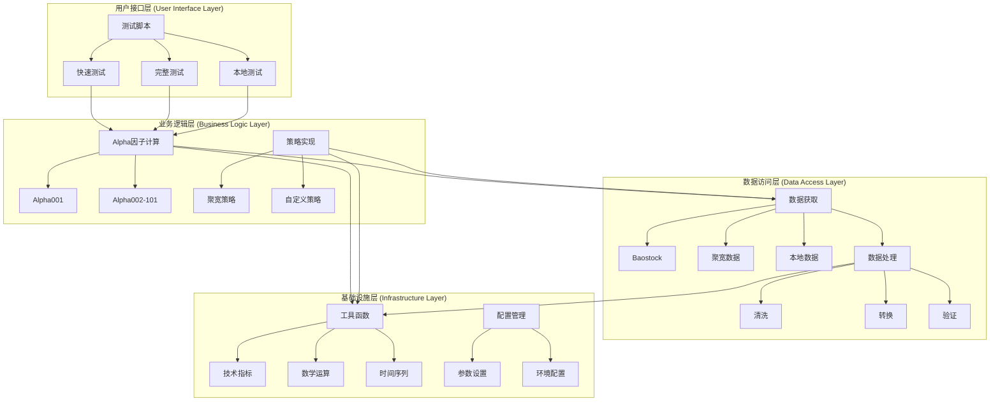
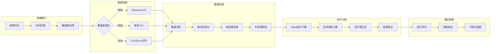
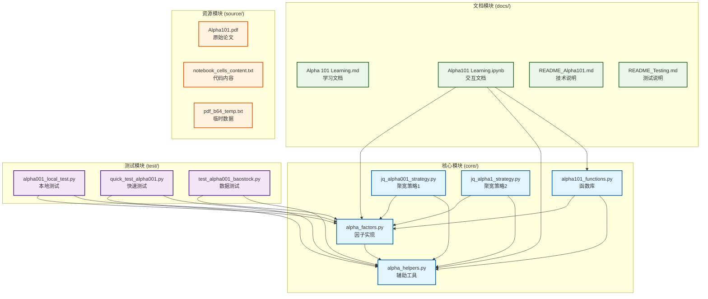
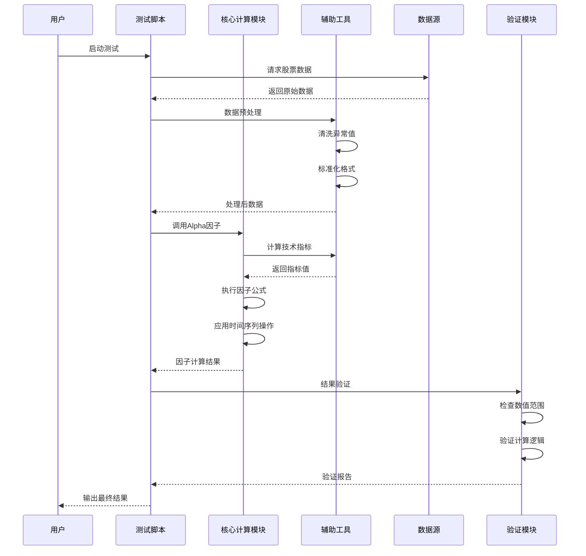
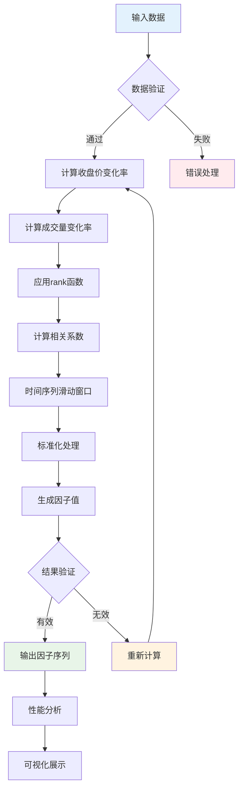
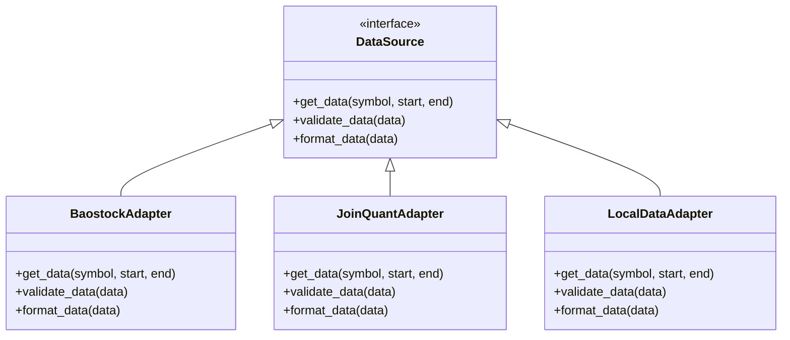

# Quant - Alpha101

## 项目简介

本项目是一个完整的量化交易系统，实现了 Alpha 101 因子库，并提供从数据获取、因子计算、信号生成到回测评估的端到端解决方案。

### 核心理念

**Alpha101 因子不是直接的交易信号，而是用于预测股票收益的特征变量。**

系统通过以下流程工作：
1. **数据层**: 获取和处理市场数据
2. **计算层**: 计算 Alpha 因子作为特征
3. **信号层**: 使用因子模型（机器学习/统计模型）预测收益并生成交易信号
4. **回测层**: 模拟交易并评估策略表现
5. **展示层**: 可视化结果和生成报告

详细架构设计请参考 [ARCHITECTURE.md](docs/ARCHITECTURE.md)

## 项目架构

### 🎯 新架构设计（规划中）

基于因子模型的五层架构，详见 [ARCHITECTURE.md](docs/ARCHITECTURE.md)

```
数据层 → 计算层 → 信号层 → 回测层 → 展示层
  ↓        ↓        ↓        ↓        ↓
获取数据  计算因子  生成信号  模拟交易  可视化
```

**核心改进**:
- ✅ 因子作为特征，不直接作为交易信号
- ✅ 引入因子模型层（机器学习/统计模型）
- ✅ 完整的回测引擎和风险管理
- ✅ 统一的数据接口和ETL流程
- ✅ 模块化设计，易于扩展

### 📁 当前目录结构

```
Alpha101/
├── core/                           # 核心计算代码
│   ├── alpha_factors.py           # Alpha因子核心实现
│   ├── alpha_helpers.py           # 辅助函数和工具
│   ├── alpha101_functions.py      # Alpha101函数库
│   ├── jq_alpha001_strategy.py    # 聚宽Alpha001策略
│   └── jq_alpha1_strategy.py      # 聚宽Alpha1策略
├── test/                          # 测试文件
│   ├── alpha001_local_test.py     # Alpha001本地测试
│   ├── quick_test_alpha001.py     # Alpha001快速测试
│   └── test_alpha001_baostock.py  # Baostock数据测试
├── docs/                          # 文档和学习资料
│   ├── ARCHITECTURE.md            # 新架构设计文档 ⭐
│   ├── Alpha 101 Learning.md      # Alpha因子详细说明
│   ├── Alpha101 Learning.ipynb    # 代码实现文档
│   ├── README_Alpha101.md         # Alpha101专项说明
│   └── README_Testing.md          # 测试说明文档
├── source/                        # 静态资源和数据
│   ├── Alpha101.pdf              # 原始论文
│   ├── notebook_cells_content.txt # Notebook内容
│   └── pdf_b64_temp.txt          # 临时数据文件
├── requirements.txt               # 项目依赖
└── README.md                     # 项目主说明
```

### 🏗️ 分层架构设计



### 🔄 数据流程图



### 🧩 模块依赖关系



### 🎯 架构设计理念

#### 1. **分离关注点 (Separation of Concerns)**
- **核心计算层**: 专注于Alpha因子的数学计算和算法实现
- **数据访问层**: 负责各种数据源的统一接入和处理
- **测试验证层**: 确保代码质量和因子计算的正确性
- **文档知识层**: 提供完整的学习和参考资料

#### 2. **模块化设计 (Modular Design)**
- 每个模块职责单一，便于维护和扩展
- 松耦合设计，模块间通过标准接口通信
- 支持插件式扩展，可以轻松添加新的因子或数据源

#### 3. **可测试性 (Testability)**
- 分层测试策略：单元测试 → 集成测试 → 性能测试
- 测试驱动开发，确保每个因子都有对应的验证
- 支持多种测试场景：本地测试、网络测试、快速验证

#### 4. **可扩展性 (Scalability)**
- 标准化的因子接口，便于添加新的Alpha因子
- 支持多种数据源，可以根据需要切换或组合
- 模块化的策略实现，支持不同平台的策略部署

#### 5. **文档驱动 (Documentation-Driven)**
- 完整的理论文档和实现文档
- 交互式学习环境 (Jupyter Notebook)
- 详细的API文档和使用示例

## 核心模块说明

### core/ - 核心计算代码
- **alpha_factors.py**: Alpha因子的核心实现，包含所有101个因子的计算逻辑
- **alpha_helpers.py**: 提供数据处理、技术指标计算等辅助函数
- **alpha101_functions.py**: Alpha101因子库的完整函数实现
- **jq_alpha001_strategy.py**: 基于聚宽平台的Alpha001策略实现
- **jq_alpha1_strategy.py**: 基于聚宽平台的Alpha1策略实现

### test/ - 测试模块
- **alpha001_local_test.py**: Alpha001因子的本地测试脚本
- **quick_test_alpha001.py**: Alpha001因子的快速验证测试
- **test_alpha001_baostock.py**: 使用Baostock数据源的完整测试

### docs/ - 文档模块
- **Alpha 101 Learning.md**: 所有101个Alpha因子的详细说明和逻辑解读
- **Alpha101 Learning.ipynb**: 交互式代码实现和分析文档
- **README_Alpha101.md**: Alpha101因子的专项技术说明
- **README_Testing.md**: 测试框架和使用说明

### source/ - 资源模块
- **Alpha101.pdf**: 《101 Formulaic Alphas》原始论文
- **notebook_cells_content.txt**: Jupyter Notebook单元格内容备份
- **pdf_b64_temp.txt**: PDF文件的Base64编码临时文件

## 因子类型

Alpha 101 因子涵盖了多种量化交易策略类型：

1. **动量策略**：基于价格趋势的延续性
2. **均值回归策略**：基于价格回归到均值的假设
3. **成交量分析**：基于成交量变化与价格关系
4. **价格模式识别**：基于价格形态和模式
5. **行业中性化**：去除行业因素的影响
6. **时间序列分析**：基于历史数据的时间序列模式
7. **横截面分析**：基于不同资产间的相对表现

## Alpha因子计算流程

### 📊 完整计算流程



### 🔍 Alpha001因子详细计算



## 快速开始

### 1. 环境准备

```bash
# 克隆项目
git clone https://github.com/YutaoWang03/Quant---Alpha101.git
cd Quant---Alpha101

# 安装依赖
pip install -r requirements.txt
```

### 2. 运行测试

```bash
# 快速测试Alpha001因子
python test/quick_test_alpha001.py

# 完整测试（需要网络连接获取数据）
python test/test_alpha001_baostock.py

# 本地测试
python test/alpha001_local_test.py
```

### 3. 使用核心模块

```python
# 导入Alpha因子
from core.alpha_factors import Alpha001
from core.alpha_helpers import get_stock_data

# 获取数据并计算因子
data = get_stock_data('000001.SZ', '2023-01-01', '2023-12-31')
alpha001_value = Alpha001(data)
```

## 开发指南

### 🏛️ 架构层次详解

#### 第一层：用户接口层 (Presentation Layer)
```python
# 测试脚本示例
from test.quick_test_alpha001 import run_quick_test
from test.test_alpha001_baostock import run_full_test

# 用户只需要调用简单的接口
result = run_quick_test()
detailed_result = run_full_test('000001.SZ', '2023-01-01', '2023-12-31')
```

#### 第二层：业务逻辑层 (Business Logic Layer)
```python
# Alpha因子计算核心
from core.alpha_factors import Alpha001, Alpha002
from core.alpha_helpers import calculate_returns, rank_transform

# 因子计算的标准流程
def calculate_alpha_factor(data, factor_class):
    processed_data = preprocess_data(data)
    factor_value = factor_class.calculate(processed_data)
    return validate_result(factor_value)
```

#### 第三层：数据访问层 (Data Access Layer)
```python
# 统一的数据接口
from core.alpha_helpers import DataProvider

class DataProvider:
    def get_stock_data(self, symbol, start_date, end_date, source='baostock'):
        if source == 'baostock':
            return self._fetch_baostock_data(symbol, start_date, end_date)
        elif source == 'joinquant':
            return self._fetch_joinquant_data(symbol, start_date, end_date)
        else:
            return self._load_local_data(symbol, start_date, end_date)
```

#### 第四层：基础设施层 (Infrastructure Layer)
```python
# 基础工具和配置
from core.alpha_helpers import (
    moving_average, 
    correlation, 
    rank, 
    delay,
    ts_sum,
    ts_rank
)

# 所有Alpha因子都依赖这些基础函数
```

### 添加新因子

#### 1. 在 `core/alpha_factors.py` 中实现因子计算逻辑

```python
class Alpha002:
    """
    Alpha002: (-1 * correlation(rank(delta(log(volume), 2)), rank(((close - open) / open)), 6))
    """
    
    @staticmethod
    def calculate(data):
        # 实现具体的计算逻辑
        volume_delta = delta(log(data['volume']), 2)
        price_change = (data['close'] - data['open']) / data['open']
        
        volume_rank = rank(volume_delta)
        price_rank = rank(price_change)
        
        correlation_result = correlation(volume_rank, price_rank, 6)
        return -1 * correlation_result
```

#### 2. 在 `test/` 目录下添加对应的测试文件

```python
# test/test_alpha002.py
import unittest
from core.alpha_factors import Alpha002
from core.alpha_helpers import generate_test_data

class TestAlpha002(unittest.TestCase):
    def setUp(self):
        self.test_data = generate_test_data()
    
    def test_alpha002_calculation(self):
        result = Alpha002.calculate(self.test_data)
        self.assertIsNotNone(result)
        self.assertTrue(len(result) > 0)
```

#### 3. 更新 `docs/` 中的相关文档

### 测试框架

#### 分层测试策略

```mermaid
pyramid
    title 测试金字塔
    
    "E2E测试" : 5
    "集成测试" : 15  
    "单元测试" : 80
```

- **单元测试 (80%)**: 测试单个因子的计算逻辑
  ```bash
  python -m pytest test/test_alpha001.py -v
  ```

- **集成测试 (15%)**: 测试数据获取和因子计算的完整流程
  ```bash
  python test/test_alpha001_baostock.py
  ```

- **端到端测试 (5%)**: 测试完整的用户场景
  ```bash
  python test/quick_test_alpha001.py
  ```

### 数据源支持

#### 数据源适配器模式



- **Baostock**: 免费的A股历史数据
  ```python
  from core.alpha_helpers import BaostockDataProvider
  provider = BaostockDataProvider()
  data = provider.get_stock_data('000001.SZ', '2023-01-01', '2023-12-31')
  ```

- **聚宽(JoinQuant)**: 专业量化平台数据接口
  ```python
  from core.alpha_helpers import JoinQuantDataProvider
  provider = JoinQuantDataProvider(api_key='your_api_key')
  data = provider.get_stock_data('000001.XSHE', '2023-01-01', '2023-12-31')
  ```

- **自定义数据源**: 支持CSV、Excel等格式的本地数据
  ```python
  from core.alpha_helpers import LocalDataProvider
  provider = LocalDataProvider()
  data = provider.load_from_csv('data/stock_data.csv')
  ```

## 性能优化

- 使用向量化计算提高因子计算效率
- 支持多进程并行计算多个因子
- 内存优化的数据处理流程
- 缓存机制减少重复计算

## 贡献指南

1. Fork 本项目
2. 创建特性分支 (`git checkout -b feature/AmazingFeature`)
3. 提交更改 (`git commit -m 'Add some AmazingFeature'`)
4. 推送到分支 (`git push origin feature/AmazingFeature`)
5. 开启 Pull Request

## 许可证

本项目采用 MIT 许可证 - 查看 [LICENSE](LICENSE) 文件了解详情

## 参考资料

- [《101 Formulaic Alphas》原始论文](source/Alpha101.pdf)
- [Baostock数据接口文档](http://baostock.com/)
- [聚宽量化平台](https://www.joinquant.com/)
- [量化交易相关资源](docs/README_Alpha101.md)

## 联系方式

- 项目维护者: YutaoWang03
- 项目主页: https://github.com/YutaoWang03/Quant---Alpha101

---

**注意**: 本项目仅供学习和研究使用，不构成投资建议。量化交易存在风险，请谨慎使用。
