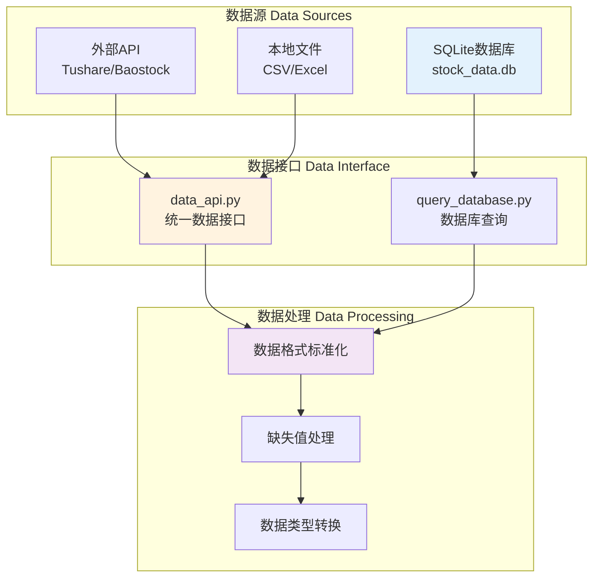
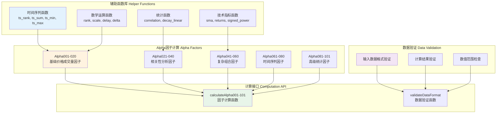
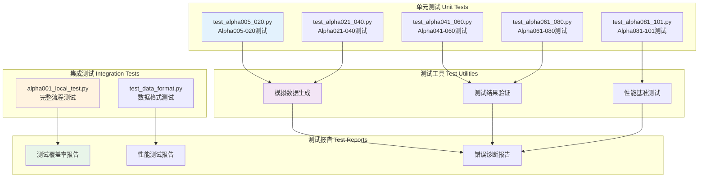
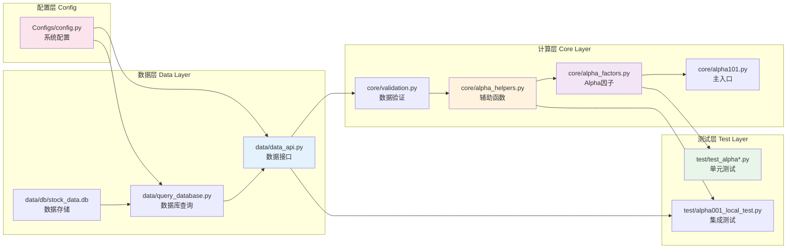
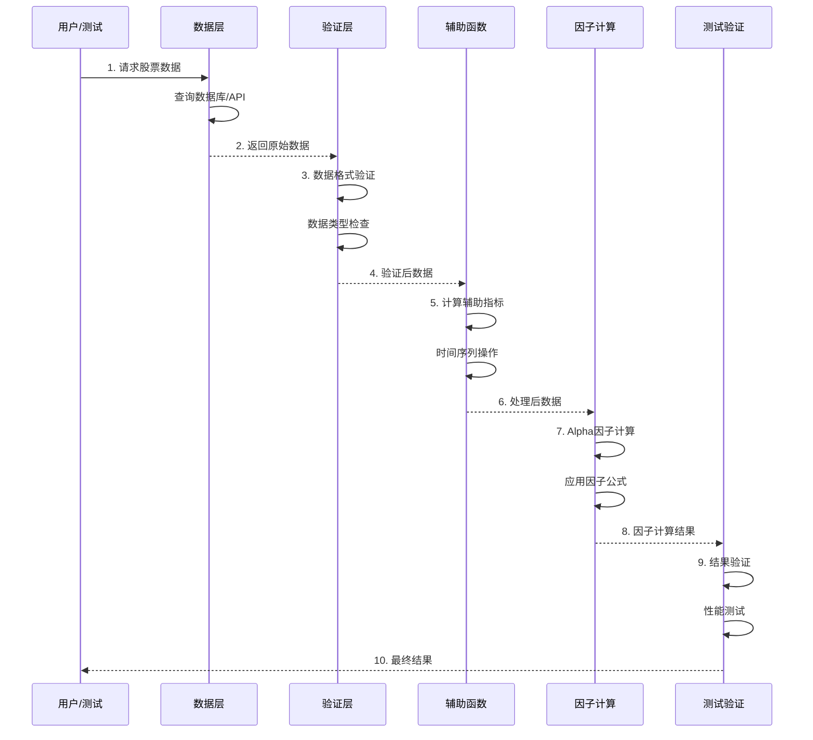
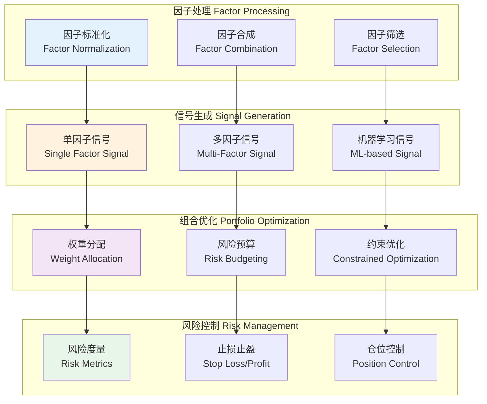
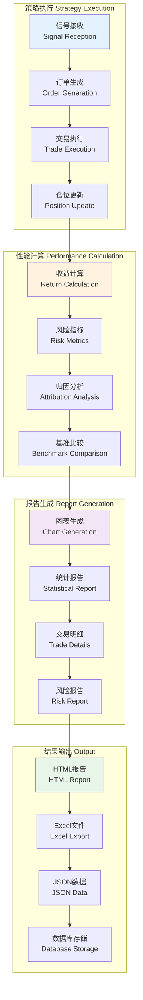
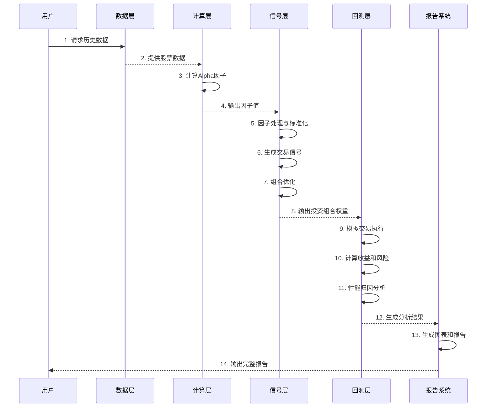

# Alpha101 量化因子系统架构设计

## 版本说明

- **当前版本**: v1.0.1 (三层架构 - 已实现)
- **规划版本**: v1.0.2 (五层架构 - 规划中)

---

## v1.0.1 系统概述 (当前版本)

Alpha101 是一个完整的量化因子计算系统，实现了《101 Formulaic Alphas》论文中的全部101个Alpha因子。系统采用三层架构设计，专注于高效、准确的因子计算和验证。

### 🎯 项目状态
- **因子实现**: 101/101 (100% 完成) ✅
- **测试覆盖**: 100% (所有因子都有完整测试)
- **代码质量**: 高（统一规范、完整文档、全面验证）

### 核心理念

**Alpha101 因子是用于预测股票收益的特征变量，不是直接的交易信号。**

- **因子（Factor）**: 基于价格、成交量等市场数据计算的数值指标
- **特征工程**: 将原始市场数据转换为预测性特征
- **量化研究**: 为后续的因子模型和策略开发提供基础

## v1.0.1 系统架构 (当前实现)

### 三层架构设计

```
┌─────────────────────────────────────────────────────────────┐
│                    3. 测试验证层 (Test Layer)                │
│              单元测试、集成测试、性能验证                      │
└─────────────────────────────────────────────────────────────┘
                              ↑
┌─────────────────────────────────────────────────────────────┐
│                  2. 核心计算层 (Computation Layer)           │
│         Alpha因子计算、辅助函数、数据验证                      │
└─────────────────────────────────────────────────────────────┘
                              ↑
┌─────────────────────────────────────────────────────────────┐
│                   1. 数据层 (Data Layer)                     │
│            数据获取、数据库查询、数据接口                      │
└─────────────────────────────────────────────────────────────┘
```

## 详细架构图

### 1. 数据层 (Data Layer)



**核心模块：**
- `data/data_api.py` - 统一数据获取接口
- `data/query_database.py` - SQLite数据库查询
- `data/db/stock_data.db` - 本地股票数据存储

### 2. 核心计算层 (Computation Layer)



**核心模块：**
- `core/alpha_factors.py` - 101个Alpha因子的完整实现
- `core/alpha_helpers.py` - 辅助函数库
- `core/validation.py` - 数据验证模块
- `core/alpha101.py` - 向后兼容的主入口

### 3. 测试验证层 (Test Layer)



**核心模块：**
- `test/test_alpha*.py` - 分组的Alpha因子测试套件
- `test/alpha001_local_test.py` - 完整的集成测试
- `test/test_data_format.py` - 数据格式验证测试

## 模块依赖关系图



## 数据流程图



## 核心设计原则

### 1. 模块化设计 (Modular Design)
- **单一职责**: 每个模块专注于特定功能
- **松耦合**: 模块间通过标准接口通信
- **高内聚**: 相关功能集中在同一模块内

### 2. 数据驱动 (Data-Driven)
- **标准化接口**: 统一的数据获取和处理接口
- **格式验证**: 严格的数据格式和类型检查
- **错误处理**: 完善的异常处理和错误恢复

### 3. 测试驱动 (Test-Driven)
- **100%覆盖**: 所有Alpha因子都有对应测试
- **分层测试**: 单元测试 + 集成测试 + 性能测试
- **持续验证**: 自动化测试确保代码质量

### 4. 性能优化 (Performance Optimized)
- **向量化计算**: 使用pandas/numpy进行高效计算
- **内存管理**: 优化大数据集的内存使用
- **缓存机制**: 避免重复计算提高效率

## 接口设计

### 数据层接口

```python
# data/data_api.py
class DataAPI:
    def get_stock_data(self, code, start_date, end_date, fields=None):
        """获取股票数据的统一接口"""
        pass
    
    def get_panel_data(self, codes, start_date, end_date, field='close'):
        """获取面板数据（透视表格式）"""
        pass
    
    def validate_data_format(self, data):
        """验证数据格式"""
        pass

# data/query_database.py  
class StockDatabase:
    def get_stock_data(self, code, start_date, end_date, fields=None):
        """从SQLite数据库查询股票数据"""
        pass
```

### 计算层接口

```python
# core/alpha_factors.py
def calculateAlpha002(close_price, volume):
    """计算Alpha002因子"""
    pass

def calculateAlpha003(close_price, volume):
    """计算Alpha003因子"""
    pass

# core/alpha_helpers.py
def ts_rank(data, window):
    """时间序列排名"""
    pass

def decay_linear(data, window):
    """线性衰减加权移动平均"""
    pass
```

### 验证层接口

```python
# core/validation.py
def validateDataFormat(data, name, allow_nan=False):
    """验证DataFrame格式和内容"""
    pass

def validate_dataframe_input(data, name):
    """验证输入数据的基本格式"""
    pass
```

## 扩展性设计

### 1. 新因子添加
```python
# 在 core/alpha_factors.py 中添加新因子
def calculateAlpha102(data_params):
    """新的Alpha因子实现"""
    # 1. 数据验证
    validateDataFormat(data_params, "data_params")
    
    # 2. 因子计算
    result = compute_factor_logic(data_params)
    
    # 3. 结果返回
    return result

# 在 test/ 中添加对应测试
def test_alpha102():
    """测试Alpha102因子"""
    pass
```

### 2. 新数据源支持
```python
# 在 data/ 中添加新的数据源适配器
class NewDataSource:
    def get_data(self, symbol, start_date, end_date):
        """新数据源的数据获取逻辑"""
        pass
```

### 3. 新辅助函数
```python
# 在 core/alpha_helpers.py 中添加新的辅助函数
def new_technical_indicator(data, params):
    """新的技术指标计算"""
    pass
```

## 维护性设计

### 1. 代码规范
- **统一命名**: 函数和变量使用一致的命名规范
- **完整文档**: 每个函数都有详细的docstring
- **类型注解**: 使用类型提示提高代码可读性

### 2. 错误处理
- **异常捕获**: 完善的异常处理机制
- **错误日志**: 详细的错误信息记录
- **优雅降级**: 在数据不足时的合理处理

### 3. 配置管理
- **集中配置**: 通过 Configs/config.py 管理系统参数
- **环境分离**: 支持不同环境的配置切换
- **参数验证**: 配置参数的有效性检查

## 性能特性

### 1. 计算效率
- **向量化操作**: 大量使用pandas的向量化计算
- **内存优化**: 合理的数据结构选择和内存管理
- **并行处理**: 支持多进程并行计算多个因子

### 2. 数据处理
- **增量更新**: 支持数据的增量更新和处理
- **缓存机制**: 中间结果缓存避免重复计算
- **批量处理**: 支持批量股票的因子计算

### 3. 测试性能
- **快速测试**: 单元测试执行时间控制在秒级
- **并行测试**: 支持测试用例的并行执行
- **性能基准**: 建立性能基准和回归测试

## 总结

Alpha101系统采用清晰的三层架构，实现了完整的101个Alpha因子计算功能。系统具有良好的模块化设计、完善的测试覆盖、优秀的扩展性和维护性。通过标准化的接口设计和严格的数据验证，确保了系统的稳定性和可靠性。

---

# v1.0.2 架构设计 (规划版本)

## 系统概述

v1.0.2 将在现有三层架构基础上扩展为五层架构，增加信号层和回测层，形成完整的量化交易系统。

### 🎯 v1.0.2 目标
- **完整交易链路**: 从因子计算到信号生成再到策略回测
- **模块化设计**: 每层职责清晰，便于独立开发和测试
- **可扩展性**: 支持多种信号生成策略和回测框架
- **生产就绪**: 提供完整的量化交易解决方案

## v1.0.2 五层架构设计

### 架构概览

```
┌─────────────────────────────────────────────────────────────┐
│                  5. 回测验证层 (Backtest Layer)              │
│           策略回测、性能评估、风险分析、报告生成               │
└─────────────────────────────────────────────────────────────┘
                              ↑
┌─────────────────────────────────────────────────────────────┐
│                   4. 信号层 (Signal Layer)                  │
│         信号生成、组合优化、风险控制、仓位管理                 │
└─────────────────────────────────────────────────────────────┘
                              ↑
┌─────────────────────────────────────────────────────────────┐
│                  3. 测试验证层 (Test Layer)                  │
│              单元测试、集成测试、性能验证                      │
└─────────────────────────────────────────────────────────────┘
                              ↑
┌─────────────────────────────────────────────────────────────┐
│                  2. 核心计算层 (Computation Layer)           │
│         Alpha因子计算、辅助函数、数据验证                      │
└─────────────────────────────────────────────────────────────┘
                              ↑
┌─────────────────────────────────────────────────────────────┐
│                   1. 数据层 (Data Layer)                     │
│            数据获取、数据库查询、数据接口                      │
└─────────────────────────────────────────────────────────────┘
```

## 详细架构设计

### 4. 信号层 (Signal Layer) - 新增



**核心模块：**
- `signal/factor_processor.py` - 因子处理和标准化
- `signal/signal_generator.py` - 信号生成引擎
- `signal/portfolio_optimizer.py` - 组合优化器
- `signal/risk_manager.py` - 风险管理模块

### 5. 回测验证层 (Backtest Layer) - 新增



**核心模块：**
- `backtest/strategy_engine.py` - 策略执行引擎
- `backtest/performance_analyzer.py` - 性能分析器
- `backtest/report_generator.py` - 报告生成器
- `backtest/data_exporter.py` - 数据导出器

## v1.0.2 项目结构

```
Alpha101/
├── core/                          # 核心计算层 (v1.0.1)
│   ├── alpha_factors.py          # Alpha因子实现
│   ├── alpha_helpers.py          # 辅助函数库
│   ├── validation.py             # 数据验证
│   └── alpha101.py               # 主入口
│
├── data/                          # 数据层 (v1.0.1)
│   ├── data_api.py               # 统一数据接口
│   ├── query_database.py         # 数据库查询
│   └── db/stock_data.db          # SQLite数据库
│
├── signal/                        # 信号层 (v1.0.2 新增)
│   ├── __init__.py
│   ├── factor_processor.py       # 因子处理器
│   ├── signal_generator.py       # 信号生成器
│   ├── portfolio_optimizer.py    # 组合优化器
│   ├── risk_manager.py           # 风险管理器
│   └── models/                   # 机器学习模型
│       ├── __init__.py
│       ├── linear_model.py       # 线性模型
│       ├── tree_model.py         # 树模型
│       └── neural_network.py     # 神经网络
│
├── backtest/                      # 回测层 (v1.0.2 新增)
│   ├── __init__.py
│   ├── strategy_engine.py        # 策略执行引擎
│   ├── performance_analyzer.py   # 性能分析器
│   ├── report_generator.py       # 报告生成器
│   ├── data_exporter.py          # 数据导出器
│   └── templates/                # 报告模板
│       ├── html_template.html
│       └── excel_template.xlsx
│
├── test/                          # 测试层 (v1.0.1)
│   ├── test_alpha*.py            # Alpha因子测试
│   ├── test_signal/              # 信号层测试 (v1.0.2 新增)
│   │   ├── test_factor_processor.py
│   │   ├── test_signal_generator.py
│   │   └── test_portfolio_optimizer.py
│   └── test_backtest/            # 回测层测试 (v1.0.2 新增)
│       ├── test_strategy_engine.py
│       └── test_performance_analyzer.py
│
├── examples/                      # 使用示例 (v1.0.2 扩展)
│   ├── basic_factor_usage.py     # 基础因子使用
│   ├── signal_generation.py      # 信号生成示例
│   ├── portfolio_optimization.py # 组合优化示例
│   └── full_backtest.py          # 完整回测示例
│
├── configs/                       # 配置管理 (v1.0.2 扩展)
│   ├── factor_config.yaml        # 因子配置
│   ├── signal_config.yaml        # 信号配置
│   ├── backtest_config.yaml      # 回测配置
│   └── risk_config.yaml          # 风险配置
│
└── docs/                          # 文档
    ├── ARCHITECTURE.md           # 架构文档
    ├── v1.0.2_MIGRATION.md      # 迁移指南
    └── API_REFERENCE.md          # API参考
```

## v1.0.2 数据流程图



## v1.0.2 核心接口设计

### 信号层接口

```python
# signal/factor_processor.py
class FactorProcessor:
    def normalize_factors(self, factors: pd.DataFrame) -> pd.DataFrame:
        """因子标准化"""
        pass
    
    def combine_factors(self, factors: Dict[str, pd.DataFrame], weights: Dict[str, float]) -> pd.DataFrame:
        """因子合成"""
        pass
    
    def select_factors(self, factors: pd.DataFrame, method: str = 'ic') -> List[str]:
        """因子筛选"""
        pass

# signal/signal_generator.py
class SignalGenerator:
    def generate_single_factor_signal(self, factor: pd.DataFrame, method: str = 'quantile') -> pd.DataFrame:
        """单因子信号生成"""
        pass
    
    def generate_multi_factor_signal(self, factors: pd.DataFrame, model: str = 'linear') -> pd.DataFrame:
        """多因子信号生成"""
        pass

# signal/portfolio_optimizer.py
class PortfolioOptimizer:
    def optimize_weights(self, signals: pd.DataFrame, constraints: Dict) -> pd.DataFrame:
        """权重优化"""
        pass
    
    def risk_budgeting(self, signals: pd.DataFrame, risk_budget: Dict) -> pd.DataFrame:
        """风险预算"""
        pass
```

### 回测层接口

```python
# backtest/strategy_engine.py
class StrategyEngine:
    def __init__(self, initial_capital: float = 1000000):
        self.initial_capital = initial_capital
        self.positions = {}
        self.cash = initial_capital
    
    def execute_strategy(self, signals: pd.DataFrame, prices: pd.DataFrame) -> Dict:
        """执行策略回测"""
        pass
    
    def rebalance_portfolio(self, target_weights: pd.Series, current_prices: pd.Series):
        """组合再平衡"""
        pass

# backtest/performance_analyzer.py
class PerformanceAnalyzer:
    def calculate_returns(self, portfolio_value: pd.Series) -> pd.Series:
        """计算收益率"""
        pass
    
    def calculate_risk_metrics(self, returns: pd.Series) -> Dict:
        """计算风险指标"""
        pass
    
    def attribution_analysis(self, portfolio_returns: pd.Series, factor_returns: pd.DataFrame) -> Dict:
        """归因分析"""
        pass

# backtest/report_generator.py
class ReportGenerator:
    def generate_html_report(self, results: Dict, output_path: str):
        """生成HTML报告"""
        pass
    
    def generate_excel_report(self, results: Dict, output_path: str):
        """生成Excel报告"""
        pass
```

## v1.0.2 使用示例

### 完整的量化交易流程

```python
from data.data_api import DataAPI
from core.alpha_factors import calculateAlpha002, calculateAlpha003
from signal.factor_processor import FactorProcessor
from signal.signal_generator import SignalGenerator
from signal.portfolio_optimizer import PortfolioOptimizer
from backtest.strategy_engine import StrategyEngine
from backtest.performance_analyzer import PerformanceAnalyzer
from backtest.report_generator import ReportGenerator

# 1. 数据获取
with DataAPI() as api:
    codes = ['sh.000001', 'sh.000002', 'sz.000001']
    close_data = api.get_panel_data(codes, field='close')
    volume_data = api.get_panel_data(codes, field='volume')

# 2. 因子计算
alpha002 = calculateAlpha002(close_data, volume_data)
alpha003 = calculateAlpha003(close_data, volume_data)
factors = {'alpha002': alpha002, 'alpha003': alpha003}

# 3. 因子处理
processor = FactorProcessor()
normalized_factors = processor.normalize_factors(pd.concat(factors.values(), axis=1))
combined_factor = processor.combine_factors(factors, {'alpha002': 0.6, 'alpha003': 0.4})

# 4. 信号生成
signal_gen = SignalGenerator()
signals = signal_gen.generate_multi_factor_signal(combined_factor, model='linear')

# 5. 组合优化
optimizer = PortfolioOptimizer()
weights = optimizer.optimize_weights(signals, constraints={'max_weight': 0.1, 'min_weight': -0.05})

# 6. 策略回测
engine = StrategyEngine(initial_capital=1000000)
backtest_results = engine.execute_strategy(weights, close_data)

# 7. 性能分析
analyzer = PerformanceAnalyzer()
performance_metrics = analyzer.calculate_risk_metrics(backtest_results['returns'])
attribution = analyzer.attribution_analysis(backtest_results['returns'], combined_factor)

# 8. 报告生成
reporter = ReportGenerator()
reporter.generate_html_report({
    'backtest_results': backtest_results,
    'performance_metrics': performance_metrics,
    'attribution': attribution
}, 'reports/strategy_report.html')
```

## v1.0.2 扩展特性

### 1. 机器学习集成
- 支持线性回归、随机森林、神经网络等模型
- 自动特征工程和模型选择
- 交叉验证和超参数优化

### 2. 风险管理增强
- VaR和CVaR风险度量
- 动态止损和仓位控制
- 行业和风格中性化

### 3. 高级回测功能
- 交易成本和滑点模拟
- 多频率回测支持
- 实时策略监控

### 4. 可视化和报告
- 交互式图表和仪表板
- 自定义报告模板
- 实时性能监控

## v1.0.1 到 v1.0.2 迁移路径

### 阶段1: 信号层开发 (预计4-6周)
1. 实现因子处理模块
2. 开发信号生成引擎
3. 构建组合优化器
4. 集成风险管理功能

### 阶段2: 回测层开发 (预计6-8周)
1. 构建策略执行引擎
2. 实现性能分析器
3. 开发报告生成系统
4. 集成数据导出功能

### 阶段3: 集成测试 (预计2-3周)
1. 端到端测试
2. 性能优化
3. 文档完善
4. 用户验收测试

### 阶段4: 部署和维护 (持续)
1. 生产环境部署
2. 监控和日志系统
3. 用户培训和支持
4. 持续功能迭代

## 总结

v1.0.2 架构设计将Alpha101从一个因子计算库升级为完整的量化交易系统。通过增加信号层和回测层，系统将具备：

- **完整的交易链路**: 从数据到信号到回测的全流程覆盖
- **模块化设计**: 每层职责清晰，便于开发和维护
- **高度可扩展**: 支持多种模型和策略的灵活配置
- **生产就绪**: 提供企业级的量化交易解决方案

这个设计为Alpha101项目的未来发展奠定了坚实的基础，使其能够满足更复杂的量化投资需求。