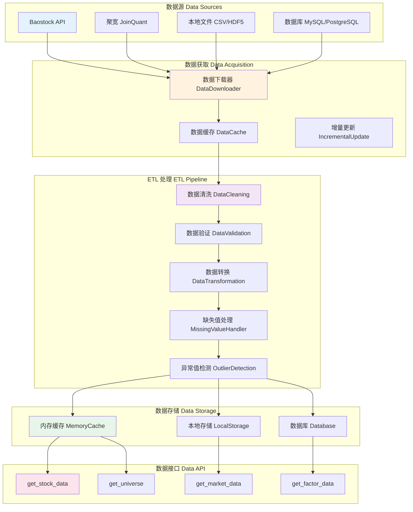
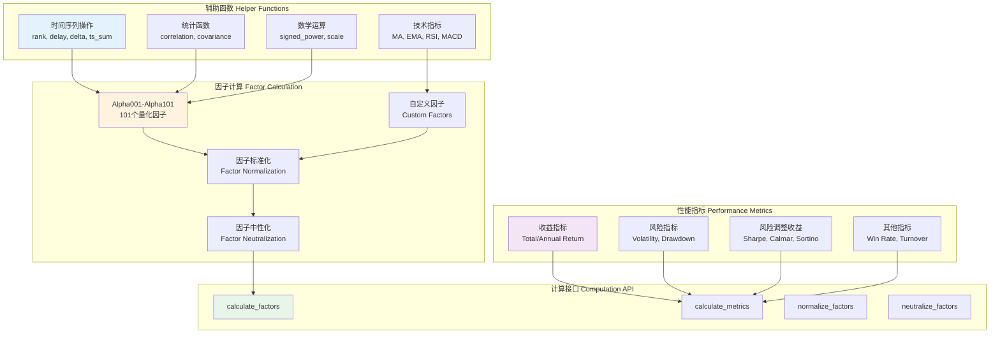
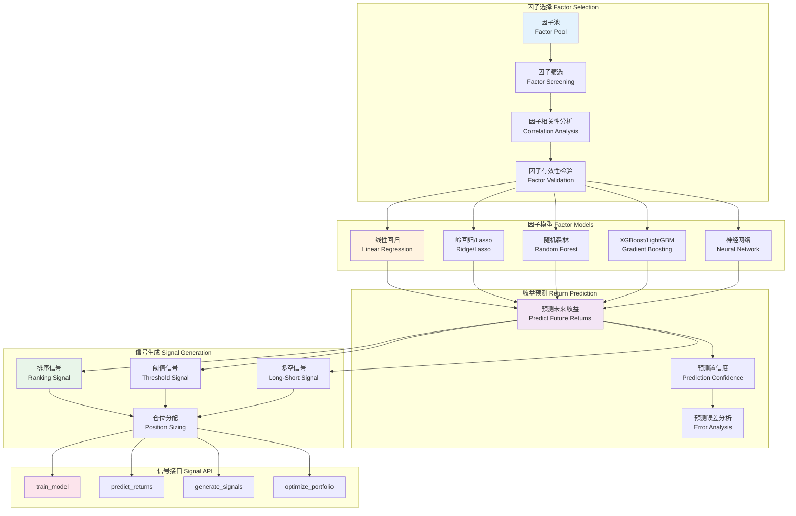
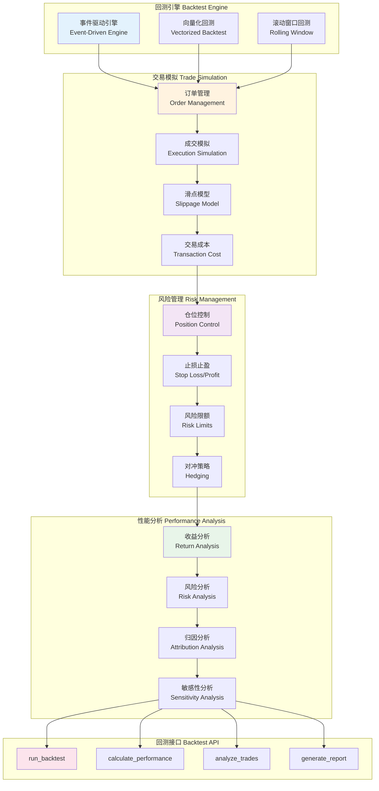
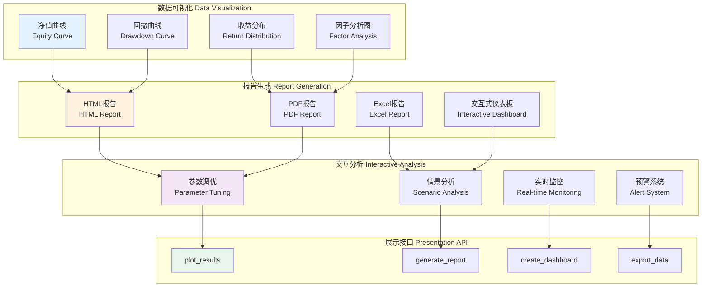
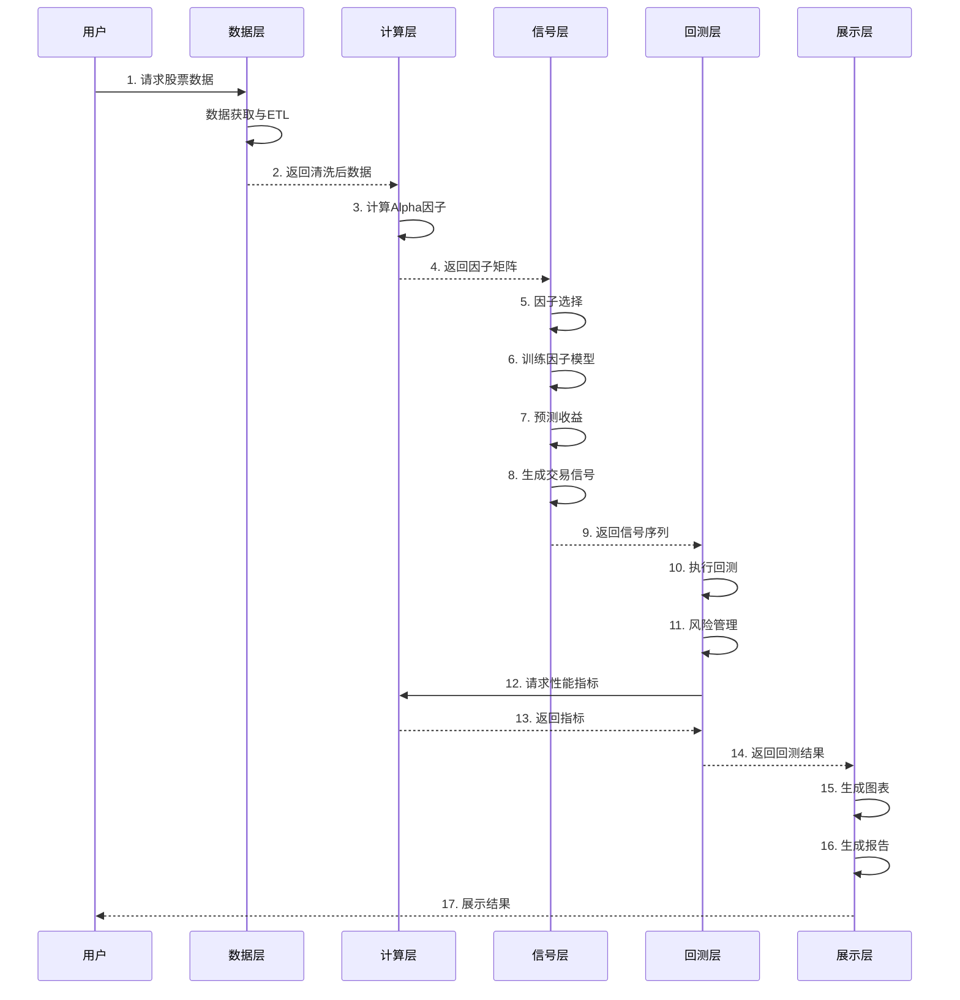
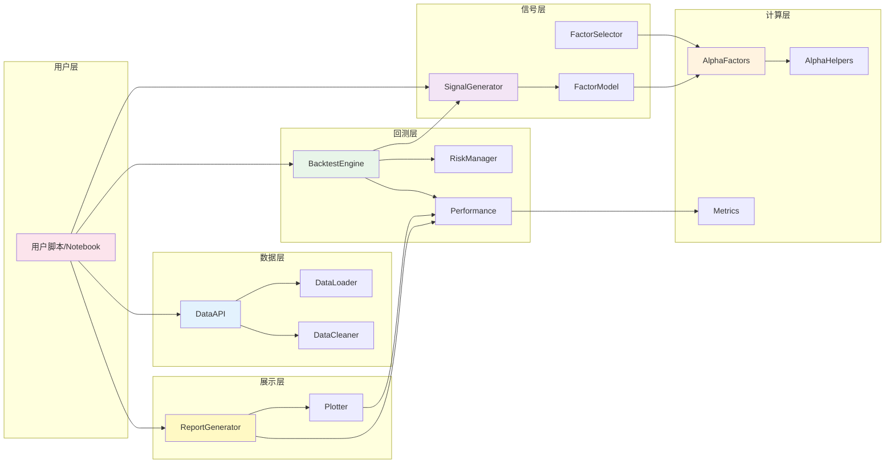

# Alpha101 量化交易系统架构设计

## 系统概述

本系统是一个完整的量化交易框架，从数据获取、因子计算、信号生成到回测评估，提供端到端的解决方案。

## 核心理念

**Alpha101 因子不是交易信号，而是预测收益的特征变量。**

- **因子（Factor）**: 描述股票特征的数值指标
- **因子模型（Factor Model）**: 使用多个因子预测股票未来收益
- **交易信号（Trading Signal）**: 基于预测收益生成的买卖决策

## 系统架构

### 五层架构设计

```
┌─────────────────────────────────────────────────────────────┐
│                      5. 展示层 (Presentation)                │
│              可视化、报告生成、交互式分析                      │
└─────────────────────────────────────────────────────────────┘
                              ↑
┌─────────────────────────────────────────────────────────────┐
│                    4. 回测层 (Backtesting)                   │
│           历史数据回测、性能评估、风险分析                     │
└─────────────────────────────────────────────────────────────┘
                              ↑
┌─────────────────────────────────────────────────────────────┐
│              3. 信号层 (Signal Generation)                   │
│        因子模型、机器学习、交易信号生成                        │
└─────────────────────────────────────────────────────────────┘
                              ↑
┌─────────────────────────────────────────────────────────────┐
│                2. 核心计算层 (Computation)                    │
│         因子计算、辅助函数、性能指标                           │
└─────────────────────────────────────────────────────────────┘
                              ↑
┌─────────────────────────────────────────────────────────────┐
│                   1. 数据层 (Data Layer)                     │
│            数据获取、ETL、数据清洗、数据存储                   │
└─────────────────────────────────────────────────────────────┘
```

## 详细架构图

### 1. 数据层 (Data Layer)



**核心模块：**
- `data/data_loader.py` - 数据加载器基类
- `data/baostock_loader.py` - Baostock 数据源
- `data/data_cleaner.py` - 数据清洗
- `data/data_cache.py` - 数据缓存管理
- `data/data_api.py` - 统一数据接口

### 2. 核心计算层 (Computation Layer)



**核心模块：**
- `core/alpha_helpers.py` - 辅助函数库
- `core/alpha_factors.py` - Alpha101 因子实现
- `core/custom_factors.py` - 自定义因子
- `core/factor_processor.py` - 因子处理（标准化、中性化）
- `core/metrics.py` - 性能指标计算

### 3. 信号层 (Signal Generation Layer)



**核心模块：**
- `signal/factor_selector.py` - 因子选择器
- `signal/linear_model.py` - 线性因子模型
- `signal/ml_model.py` - 机器学习模型
- `signal/signal_generator.py` - 信号生成器
- `signal/portfolio_optimizer.py` - 组合优化

### 4. 回测层 (Backtesting Layer)



**核心模块：**
- `backtest/backtest_engine.py` - 回测引擎
- `backtest/order_manager.py` - 订单管理
- `backtest/execution.py` - 成交模拟
- `backtest/risk_manager.py` - 风险管理
- `backtest/performance.py` - 性能分析

### 5. 展示层 (Presentation Layer)



**核心模块：**
- `visualization/plotter.py` - 图表绘制
- `visualization/report_generator.py` - 报告生成
- `visualization/dashboard.py` - 交互式仪表板
- `visualization/exporter.py` - 数据导出

## 完整数据流程图



## 模块调用关系图



## 新项目目录结构

```
Alpha101/
├── data/                          # 数据层
│   ├── __init__.py
│   ├── data_loader.py            # 数据加载器基类
│   ├── baostock_loader.py        # Baostock数据源
│   ├── joinquant_loader.py       # 聚宽数据源
│   ├── data_cleaner.py           # 数据清洗
│   ├── data_cache.py             # 数据缓存
│   └── data_api.py               # 统一数据接口
│
├── core/                          # 核心计算层
│   ├── __init__.py
│   ├── alpha_helpers.py          # 辅助函数
│   ├── alpha_factors.py          # Alpha101因子
│   ├── custom_factors.py         # 自定义因子
│   ├── factor_processor.py       # 因子处理
│   └── metrics.py                # 性能指标
│
├── signal/                        # 信号层
│   ├── __init__.py
│   ├── factor_selector.py        # 因子选择
│   ├── linear_model.py           # 线性模型
│   ├── ml_model.py               # 机器学习模型
│   ├── signal_generator.py       # 信号生成
│   └── portfolio_optimizer.py    # 组合优化
│
├── backtest/                      # 回测层
│   ├── __init__.py
│   ├── backtest_engine.py        # 回测引擎
│   ├── order_manager.py          # 订单管理
│   ├── execution.py              # 成交模拟
│   ├── risk_manager.py           # 风险管理
│   └── performance.py            # 性能分析
│
├── visualization/                 # 展示层
│   ├── __init__.py
│   ├── plotter.py                # 图表绘制
│   ├── report_generator.py       # 报告生成
│   ├── dashboard.py              # 交互式仪表板
│   └── exporter.py               # 数据导出
│
├── test/                          # 测试
│   ├── test_data_layer.py
│   ├── test_factors.py
│   ├── test_signals.py
│   └── test_backtest.py
│
├── examples/                      # 示例
│   ├── example_factor_analysis.py
│   ├── example_signal_generation.py
│   ├── example_backtest.py
│   └── example_full_pipeline.py
│
├── docs/                          # 文档
│   ├── ARCHITECTURE.md           # 架构文档
│   ├── API_REFERENCE.md          # API参考
│   ├── USER_GUIDE.md             # 用户指南
│   └── DEVELOPMENT.md            # 开发指南
│
├── config/                        # 配置
│   ├── data_config.yaml          # 数据配置
│   ├── factor_config.yaml        # 因子配置
│   ├── model_config.yaml         # 模型配置
│   └── backtest_config.yaml      # 回测配置
│
├── requirements.txt               # 依赖
├── setup.py                       # 安装脚本
└── README.md                      # 项目说明
```

## 使用示例

### 完整流程示例

```python
from data.data_api import DataAPI
from core.alpha_factors import calculate_all_factors
from signal.ml_model import XGBoostFactorModel
from signal.signal_generator import SignalGenerator
from backtest.backtest_engine import BacktestEngine
from visualization.report_generator import ReportGenerator

# 1. 数据层：获取数据
data_api = DataAPI(source='baostock')
stock_data = data_api.get_stock_data(
    symbols=['000001.SZ', '000002.SZ'],
    start_date='2023-01-01',
    end_date='2024-01-01'
)

# 2. 计算层：计算因子
factors = calculate_all_factors(stock_data, factor_list=['alpha001', 'alpha002', 'alpha003'])

# 3. 信号层：训练模型并生成信号
model = XGBoostFactorModel()
model.train(factors, target='future_return_5d')

signal_gen = SignalGenerator(model)
signals = signal_gen.generate_signals(factors, method='ranking', top_n=10)

# 4. 回测层：执行回测
engine = BacktestEngine(
    initial_capital=1000000,
    commission=0.0003,
    slippage=0.001
)
results = engine.run(stock_data, signals)

# 5. 展示层：生成报告
report = ReportGenerator()
report.generate(results, output='backtest_report.html')
report.plot_equity_curve(results)
```

## 关键设计原则

1. **模块化**: 每层独立，接口清晰
2. **可扩展**: 易于添加新因子、新模型、新数据源
3. **可配置**: 通过配置文件管理参数
4. **可测试**: 每个模块都有单元测试
5. **高性能**: 向量化计算，支持并行处理
6. **易用性**: 提供简洁的API和丰富的示例

## 下一步行动

1. 重构现有代码到新架构
2. 实现数据层的统一接口
3. 完善核心计算层的性能指标
4. 实现信号层的因子模型
5. 构建完整的回测引擎
6. 开发可视化和报告系统
